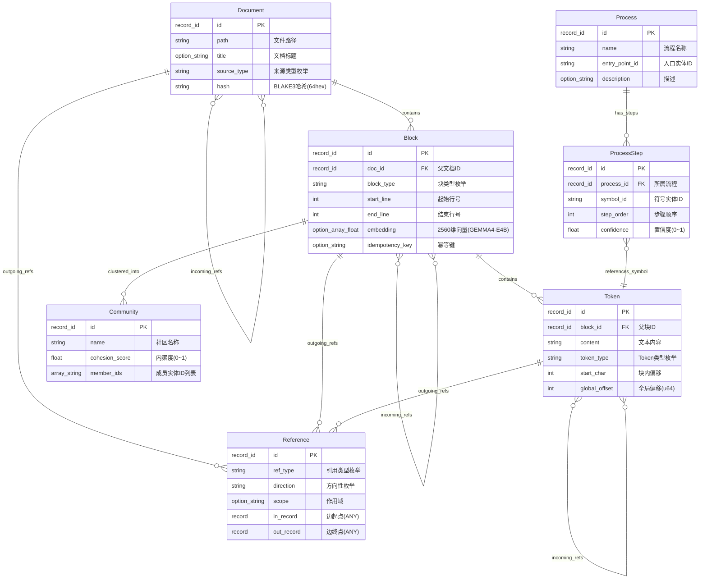
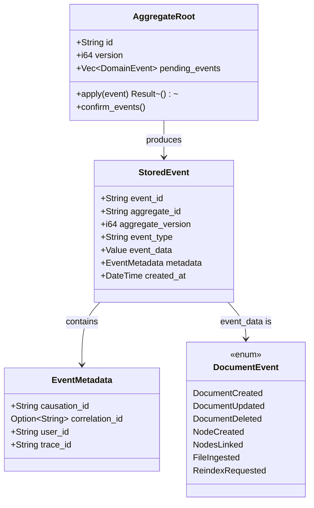

# 数据模型设计

## 1. 核心实体关系 (ER 图)

### 1.1 概念 ER 图



### 1.2 实体关系说明

#### 层次包含关系 (Has-A)

```
Document (1) ──┬──→ (N) Block
                │         │
                │         └──→ (N) Token
                │
                └──→ (N) Reference (from)
```

- 每个 **Document** 包含多个 **Block**（文档的逻辑分块）
- 每个 **Block** 包含多个 **Token**（最小语义单元）
- 所有实体都可以作为 **Reference** 边的起点（`from_id`）或终点（`to_id`）

#### 引用关系图 (Graph)

```
Token(A) --[Usage]--> Token(B)
   ↑                       |
   |                  [Definition]
   |                       |
   +--------[Inherit]--+ Block(C)
```

- **Reference** 是有向边，连接任意两个实体
- 支持六种语义类型：`Definition`, `Usage`, `Link`, `Inherit`, `Implement`, `Constrain`
- 支持三种方向模式：`OneWay`, `TwoWay`, `ImplicitTwoWay`

#### 高层抽象关系

```
(N) Token/Block ──[聚类]──→ Community
(N) Token/Block ──[流程]──→ Process ──[步骤]──→ ProcessStep
```

- **Community**：由图聚类算法（如 Louvain）从 L3 层实体中发现的高层语义社区
- **Process**：表示代码执行流程或文档阅读路径的有序序列

---

## 2. SurrealDB Schema 定义

完整的 Schema 定义位于 [schema.surql](../../crates/knowledge-core/schema.surql)，以下为关键设计决策说明。

### 2.1 Schema 设计原则

| 原则 | 实现方式 |
|------|----------|
| **SCHEMAFULL 模式** | 所有表使用 `DEFINE TABLE ... SCHEMAFULL`，未定义字段被拒绝 |
| **类型安全** | 使用 SurrealDB 强类型系统：`record<T>`, `option<T>`, `array<T>` |
| **字段约束** | 每个字段附带 `ASSERT` 条件验证输入合法性 |
| **外键约束** | 通过 `record<parent_table>` 类型自动强制引用完整性 |
| **唯一性约束** | 关键业务字段建立 `UNIQUE` 索引 |
| **向量索引** | Block 表支持 MTREE 向量索引用于语义搜索 |

### 2.2 核心表结构速查

#### document 表 (L1)

```surql
DEFINE TABLE document SCHEMAFULL;
DEFINE FIELD path     ON document TYPE string  ASSERT $value != '' AND string::len($value) <= 4096;
DEFINE FIELD title    ON document TYPE option<string>;
DEFINE FIELD source_type ON document TYPE string ASSERT $value IN ['Markdown','Code','Plain'];
DEFINE FIELD hash     ON document TYPE string  ASSERT string::len($value) == 64 AND $value =~ /^[0-9a-fA-F]{64}$/;

DEFINE INDEX doc_hash_idx ON document FIELDS hash UNIQUE;      -- 幂等去重
DEFINE INDEX doc_path_idx ON document FIELDS path;              -- 路径查询
```

**关键字段说明**：
- `hash`: BLAKE3 哈希值，64 字符十六进制字符串，用于文档幂等性去重
- `source_type`: 枚举值决定解析器选择策略

#### block 表 (L2)

```surql
DEFINE TABLE block SCHEMAFULL;
DEFINE FIELD doc_id        ON block TYPE record<document>;
DEFINE FIELD block_type    ON block TYPE string  ASSERT $value IN ['Heading','Paragraph','Code','List','Table'];
DEFINE FIELD start_line    ON block TYPE int     ASSERT $value >= 0;
DEFINE FIELD end_line      ON block TYPE int     ASSERT $value >= $start_line;
DEFINE FIELD embedding     ON block TYPE option<array<float>>;           -- 2560维向量(GEMMA4-E4B)
DEFINE FIELD idempotency_key ON block TYPE option<string>;

DEFINE INDEX block_doc_id_idx  ON block FIELDS doc_id;
DEFINE INDEX block_pos_idx     ON block FIELDS doc_id, start_line, end_line;  -- 位置范围查询
DEFINE INDEX block_vec_idx     ON block MTREE embedding DIMENSION 2560 DISTANCE COSINE TYPE VECTORFN;  -- 语义搜索(GEMMA4-E4B)
DEFINE INDEX block_idemp_idx   ON block FIELDS idempotency_key UNIQUE;
```

**关键字段说明**：
- `embedding`: 可选的 2560 维浮点向量（GEMMA4-E4B 纯 Rust 推理输出维度）
- `idempotency_key`: 格式建议 `{block_type}_{start_line}_{end_line}`，防止重复插入
- `block_vec_idx`: 余弦距离度量向量索引，核心 RAG 能力基础

#### token 表 (L3)

```surql
DEFINE TABLE token SCHEMAFULL;
DEFINE FIELD block_id     ON token TYPE record<block>;
DEFINE FIELD content      ON token TYPE string  ASSERT $value != '' AND string::len($value) <= 1024;
DEFINE FIELD token_type   ON token TYPE string  ASSERT $value IN ['Word','Punct','Symbol','Keyword','Identifier'];
DEFINE FIELD start_char   ON token TYPE int     ASSERT $value >= 0;
DEFINE_FIELD global_offset ON token TYPE int     ASSERT $value >= 0;

DEFINE INDEX token_block_idx  ON token FIELDS block_id;
DEFINE INDEX token_global_idx ON token FIELDS global_offset;       -- 跨块定位
DEFINE INDEX token_content_idx ON token FIELDS content;             -- 精确匹配
```

**位置系统**：
- `start_char`: 块内相对字符偏移（用于块内文本定位）
- `global_offset`: 全局绝对偏移（u64 范围，用于跨块连续文本拼接）

#### references 表 (LR 有向边)

```surql
DEFINE TABLE references SCHEMAFULL TYPE RELATION FROM ANY TO ANY;
DEFINE FIELD ref_type  ON references TYPE string  ASSERT $value IN ['Definition','Usage','Link','Inherit','Implement','Constrain'];
DEFINE FIELD direction ON references TYPE string  ASSERT $value IN ['OneWay','TwoWay','ImplicitTwoWay'];
DEFINE FIELD scope     ON references TYPE option<string>;

DEFINE INDEX ref_type_idx ON references FIELDS ref_type, direction;
DEFINE INDEX ref_from_idx ON references FIELDS in;    -- 出边查询
DEFINE INDEX ref_to_idx   ON references FIELDS out;    -- 入边查询
```

**SurrealDB 关系表特性**：
- `TYPE RELATION FROM ANY TO ANY`: 边可以连接任意两个表的记录
- 自动生成 `in` 和 `out` 字段表示边的起点和终点
- 原生支持图遍历查询

### 2.3 Schema 版本追踪

```surql
DEFINE TABLE schema_version SCHEMAFULL;
DEFINE FIELD version    ON schema_version TYPE string;          -- 语义化版本号
DEFINE FIELD applied_at ON schema_version TYPE datetime;        -- 应用时间戳
DEFINE FIELD checksum   ON schema_version TYPE string;          -- BLAKE3 校验和

DEFINE INDEX version_idx ON schema_version FIELDS version UNIQUE;
```

---

## 3. 向量索引结构

### 3.1 向量嵌入规格

| 参数 | 值 | 说明 |
|------|-----|------|
| **维度** | 2560 | GEMMA4-E4B 纯 Rust 推理输出维度 |
| **数据类型** | f32 | 32 位浮点数 |
| **归一化** | L2 归一化 | 启用余弦相似度计算 |
| **存储后端** | Qdrant (生产) / HNSWLIB (开发) | 通过 `VectorStoreBackend` trait 抽象 |

### 3.2 Qdrant 集合配置

```rust
// 伪代码 - Qdrant Collection 配置
CollectionConfig {
    name: "knowledge_blocks",
    vectors: VectorsConfig {
        size: 2560,  // GEMMA4-E4B 输出维度
        distance: Distance::Cosine,
        // HNSW 索引参数
        hnsw_config: HnswConfig {
            m: 16,              // 每节点连接数
            ef_construct: 100,  // 构建时搜索宽度
            full_scan_threshold: 10000,  // 低于此数量时全扫描
        },
    },
    // 有效载荷索引
    payload_index: [
        PayloadIndex { field: "doc_id", type: Keyword },
        PayloadIndex { field: "block_type", type: Keyword },
    ],
}
```

### 3.3 向量存储抽象层

系统通过 [`VectorStoreBackend`](crates/knowledge-core/src/vector_store/mod.rs) trait 统一多种后端：

```rust
/// 向量存储后端 trait
#[async_trait]
pub trait VectorStoreBackend: Send + Sync {
    /// 上传/更新向量
    async fn upsert(&self, points: Vec<VectorPoint>) -> Result<()>;

    /// 删除向量
    async fn delete(&self, ids: Vec<String>) -> Result<()>;

    /// 相似度搜索
    async fn search(
        &self,
        query_vector: Vec<f32>,
        limit: u32,
        filter: Option<FilterCondition>,
    ) -> Result<Vec<SearchResult>>;

    /// 批量获取向量
    async fn fetch(&self, ids: Vec<String>) -> Result<Vec<Option<VectorPoint>>>;
}
```

**可用实现**：
| 后端 | Feature Flag | 适用场景 |
|------|-------------|----------|
| `QdrantBackend` | `qdrant` | 生产环境、大规模数据 |
| `HnswlibBackend` | `hnswlib` | 开发测试、无外部依赖 |

---

## 4. 事件溯源 Schema

### 4.1 事件存储模型

CQRS + Event Sourcing 架构中的事件采用以下存储格式：



### 4.2 事件类型定义

位于 [`cqrs/event_store.rs`](../../crates/knowledge-core/src/cqrs/event_store.rs)：

| 事件类型 | 触发条件 | 影响范围 |
|----------|----------|----------|
| `DocumentCreated` | 新文档摄入 | 创建 Document 记录 |
| `DocumentUpdated` | 文档内容变更 | 更新 Document + 失效缓存 |
| `DocumentDeleted` | 文档删除 | 级联删除 Block/Token/Reference |
| `NodeCreated` | 新知识节点创建 | 创建 Block 或 Token |
| `NodesLinked` | 建立引用关系 | 创建 Reference 边 |
| `FileIngested` | 文件解析完成 | 触发嵌入计算 |
| `ReindexRequested` | 手动触发重建 | 清空并重建所有索引 |

### 4.3 事件流示例

```
时间轴 →
─────────────────────────────────────────────────────→

[FileUpload] → [ParseComplete] → [IngestFileCommand]
                                    ↓
                           ┌──────────────────┐
                           │  Event Store 写入  │
                           │  FileIngested 事件  │
                           └────────┬─────────┘
                                    ↓
                    ┌───────────────┼───────────────┐
                    ↓               ↓               ↓
            [DocumentCreated]  [NodeCreated×N]  [NodesLinked×M]
                    ↓               ↓               ↓
            [DB Write]        [DB Write]      [DB Write]
                    ↓               ↓               ↓
            [Cache Invalid]   [Embedding]     [Index Update]
```

---

## 5. 缓存键命名规范

### 5.1 键命名规则

系统采用统一的缓存键命名规范，确保跨层（L1/L2）一致性：

```
{namespace}:{entity}:{identifier}:{attribute?}
```

### 5.2 键模板列表

| 用途 | 键模板 | 示例 | TTL |
|------|--------|------|-----|
| **文档详情** | `doc:{doc_id}` | `doc:document:abc123` | 5 min |
| **文档的块列表** | `doc:{doc_id}:blocks` | `doc:document:abc123:blocks` | 5 min |
| **单个块** | `block:{block_id}` | `block:block:def456` | 10 min |
| **块的 Token 列表** | `block:{block_id}:tokens` | `block:block:def456:tokens` | 10 min |
| **搜索结果** | `search:{query_hash}:p{page}` | `search:a1b2c3:p1` | 30 sec |
| **向量邻居** | `vec:near:{vector_id}:k{k}` | `vec:near:v001:k10` | 2 min |
| **用户会话** | `sess:{session_id}` | `sess:sess_789` | 15 min |
| **权限缓存** | `perm:{user_id}:{resource}` | `perm:user_001:doc_read` | 1 min |
| **Schema 版本** | `schema:version` | `schema:version` | 无过期 |
| **MCP 工具列表** | `mcp:tools` | `mcp:tools` | 5 min |

### 5.3 缓存失效策略

| 事件类型 | 失效键模式 |
|----------|-----------|
| `DocumentCreated` | 无（新文档无需失效） |
| `DocumentUpdated` | `doc:{doc_id}`, `doc:{doc_id}:blocks`, `search:*` |
| `DocumentDeleted` | `doc:{doc_id}*`, `block:doc:{doc_id}:*`, `token:block:*` |
| `NodeCreated` | `doc:{doc_id}:blocks`, `block:{block_id}` |
| `NodesLinked` | 相关实体的搜索缓存 |

### 5.4 缓存一致性保证

```
写操作 → CQRS Command → Event Store
                              ↓
                     ┌─────────────────┐
                     │  Cache Invalidation │
                     │  Publisher (EventBus)│
                     └────────┬────────┘
                              ↓
              ┌───────────────┼───────────────┐
              ↓                               ↓
       [L1 Moka Evict]                  [L2 Redis Pub/Sub]
       (进程内同步驱逐)                 (跨实例异步失效)
```

- **L1 缓存**：通过 EventBus 同步发布失效事件，本地立即驱逐
- **L2 缓存**：通过 Redis Pub/Sub 广播失效消息，其他实例订阅处理
- **最终一致性**：缓存失效与数据库写入之间允许短暂不一致窗口（通常 < 100ms）

---

## 附录: Rust 类型映射表

| SurrealDB 类型 | Rust 类型 | 说明 |
|----------------|-----------|------|
| `record` / `record<T>` | `surrealdb::opt::RecordId` | 通过 [`SafeRecordId`](../../crates/knowledge-core/src/record_id.rs) 封装 |
| `string` | `String` | UTF-8 编码 |
| `int` | `i64` | 64 位有符号整数 |
| `float` | `f64` | 64 位浮点数 |
| `bool` | `bool` | 布尔值 |
| `option<T>` | `Option<T>` | 可空字段 |
| `array<T>` | `Vec<T>` | 数组 |
| `datetime` | `chrono::DateTime<Utc>` | 时间戳 |
| `decimal` | `bigdecimal::BigDecimal` | 高精度数值 |

> 注意：当不启用 `db` feature 时，所有 `RecordIdType` 退化为 `String`。
