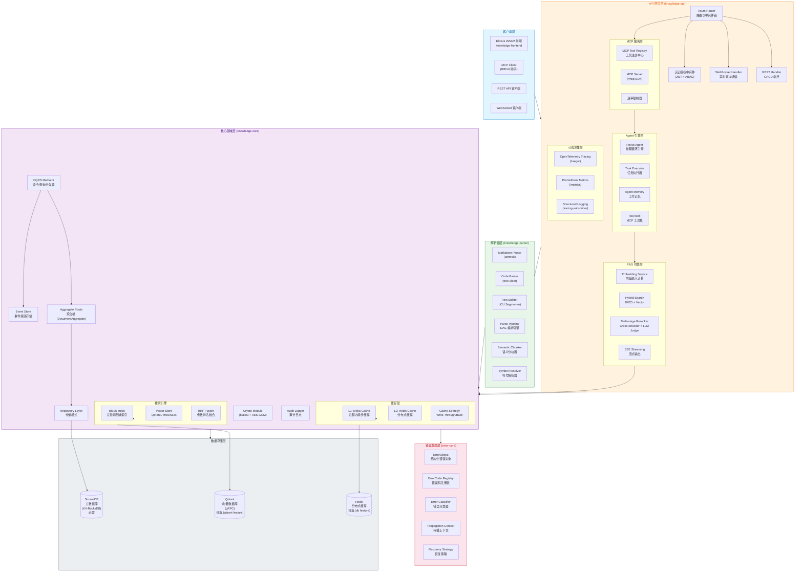
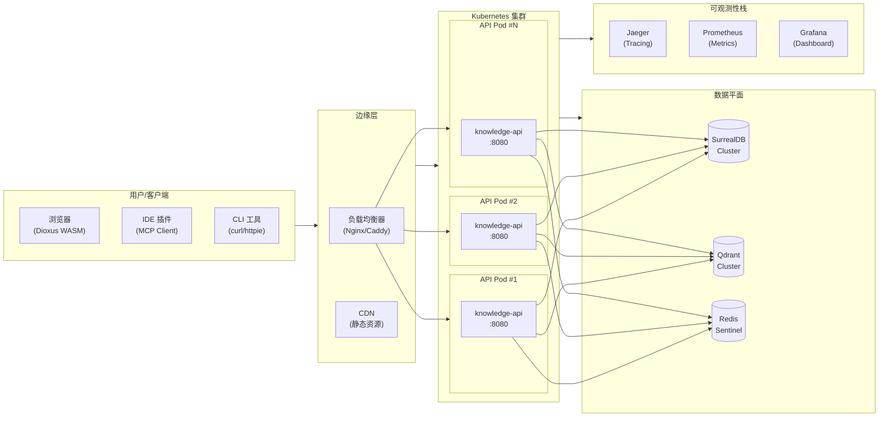
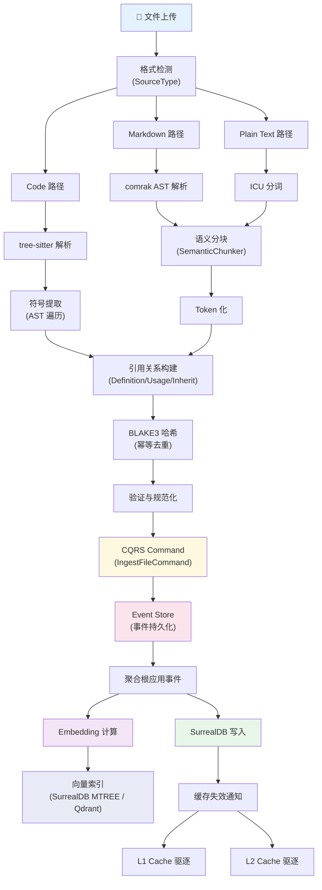
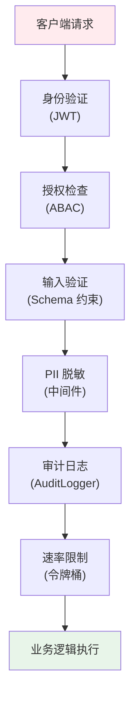

# 文本全结构化知识系统 - 架构总览

> 项目宪章：使命 — 让全球生态感知纯 Rust 知识库解决方案的可行性，公开验证错误驱动开发和流程驱动开发两大技术哲学；设计哲学 — 0 随机性，0 黑盒推断

## 1. 系统定位与目标

### 1.1 项目愿景

文本全结构化知识系统（Text Full-Structured Knowledge System）是一个基于 Rust 生态构建的**企业级知识图谱平台**，旨在将非结构化/半结构化文本（Markdown、源代码、纯文本）转化为可查询、可推理、可复用的**结构化知识图谱**。

本项目是公司纯 Rust 产品矩阵的核心知识引擎层，与 ullm（开源 LLM 网关）和 knowledge-infra（闭源 DevOps 基础设施层）协同构成完整闭环。底层由 error-core（统一错误处理，错误驱动开发）和 UPCM（通用流程控制，流程驱动开发，规划中）两大基础设施贯穿。

### 1.2 核心目标

| 目标维度 | 描述 | 量化指标 |
|----------|------|----------|
| **全结构化解析** | 将任意格式文本解析为四层节点图（Document → Block → Token → Community/Process） | 支持 15+ 种编程语言 + 3 种文档格式 |
| **语义理解** | 基于向量嵌入和混合搜索实现语义级检索 | RAG 准确率 ≥ 95%（通过多阶段重排序） |
| **实时推理** | 通过 ReAct Agent 框架支持复杂的多步推理任务 | Agent 循环延迟 < 500ms (P99) |
| **企业级可靠性** | CQRS + Event Sourcing 确保数据一致性与审计能力 | 事件溯源 100% 覆盖写操作 |
| **开放集成** | MCP 协议标准化工具接口，支持 AI 编程助手接入 | 完整 MCP Server 实现 |

### 1.3 适用场景

- **AI 编程助手**：为 IDE 提供代码库级别的语义理解和上下文感知
- **技术文档管理**：自动构建企业内部技术文档的知识图谱
- **代码审查增强**：基于依赖关系图的智能变更影响分析
- **RAG 知识库**：为大语言模型提供高质量的结构化检索增强

---

## 2. 核心概念

### 2.1 四层节点模型（4-Layer Node Model）

系统采用层次化的知识表示模型：

```
┌─────────────────────────────────────────────────┐
│              L4: 抽象层 (Abstraction)            │
│   ┌──────────────┐  ┌──────────────┐           │
│   │  Community   │  │   Process    │           │
│   │  (语义社区)   │  │  (执行流程)   │           │
│   └──────┬───────┘  └──────┬───────┘           │
│          │                 │                     │
├──────────┼─────────────────┼─────────────────────┤
│          ▼                 ▼                     │
│              L3: 叶子层 (Leaf)                   │
│         ┌─────────────────────┐                 │
│         │       Token         │                 │
│         │ (词元/最小语义单元)   │                 │
│         └──────────┬──────────┘                 │
│                    │                             │
├────────────────────┼─────────────────────────────┤
│                    ▼                             │
│              L2: 容器层 (Container)               │
│         ┌─────────────────────┐                 │
│         │        Block        │                 │
│     │ (段落/代码块/标题块)     │                  │
│         └──────────┬──────────┘                 │
│                    │                             │
├────────────────────┼─────────────────────────────┤
│                    ▼                             │
│              L1: 根层 (Root)                     │
│         ┌─────────────────────┐                 │
│         │      Document       │                 │
│         │    (原始文件实体)     │                 │
│         └─────────────────────┘                 │
└─────────────────────────────────────────────────┘
```

#### 层次说明

| 层级 | 实体 | 职责 | 关键属性 |
|------|------|------|----------|
| **L1 Document** | 文档根节点 | 表示原始文件，是所有子节点的容器 | `path`, `title`, `source_type`, `hash`(blake3) |
| **L2 Block** | 块容器节点 | 文档的逻辑分块单元（段落、代码块、标题等） | `block_type`, `start_line`, `end_line`, `embedding` |
| **L3 Token** | 词元叶子节点 | 最小不可分割语义单位 | `content`, `token_type`, `global_offset` |
| **L3.5 Reference** | 有向边 | 连接实体的引用关系 | `ref_type`, `direction`, `from_id`, `to_id` |
| **L4 Community** | 社区节点 | 图聚类发现的语义内聚实体集合 | `cohesion_score`, `member_ids` |
| **L4 Process** | 流程节点 | 从入口到出口的有序执行路径 | `entry_point_id`, `ProcessStep[]` |

### 2.2 CQRS + Event Sourcing

系统采用 **Command Query Responsibility Segregation (CQRS)** 与 **Event Sourcing** 双模式架构：

- **Command（命令）**：写操作（Create、Update、Delete），通过聚合根（Aggregate Root）执行并产生领域事件
- **Query（查询）**：读操作（Search、Get、List），优化的读模型直接查询
- **Event Store（事件存储）**：所有状态变更以不可变事件流形式持久化，支持完整审计与状态重建

### 2.3 多级缓存架构

```
请求 → [L1 Moka (进程内)] → [L2 Redis (分布式)] → [SurrealDB (持久化)]
         ↑ 命中             ↑ 命中                ↑ 最终来源
         ↓ 未命中           ↓ 未命中
```

- **L1 Cache (Moka)**：异步高性能内存缓存，基于 Tokio 运行时，TTL + 大小限制驱逐策略
- **L2 Cache (Redis)**：跨实例共享缓存层，支持缓存穿透保护和一致性哈希分片

---

## 3. 架构视图

### 3.1 逻辑架构图



### 3.2 部署架构图



### 3.3 数据流图 - 文档摄入流水线



### 3.4 技术栈选型理由

| 技术领域 | 选型方案 | 选型理由 | 替代方案对比 |
|----------|----------|----------|--------------|
| **编程语言** | Rust 2024 Edition | 内存安全保证、零成本抽象、优秀的并发模型、WASM 一等公民支持 | Go (GC 延迟)、C++ (内存不安全) |
| **Web 框架** | Axum 0.7 | 基于 Tokio hyper 的现代框架、类型安全的路由提取器、原生 WebSocket 支持 | Actix-web (Actor 模型较重)、Rocket (宏系统侵入性强) |
| **数据库** | SurrealDB 1.3 | 原生图数据库特性（RELATION 表）、多模型（KV+图+文档）、Rust 原生 SDK | PostgreSQL (需额外图扩展)、Neo4j (非 Rust 生态) |
| **向量数据库** | Qdrant 1.7 | 高性能 gRPC 接口、原生过滤支持、生产级稳定性 | Milvus (Go 生态)、Pinecone (云托管) |
| **前端框架** | Dioxus 0.5 (WASM) | React-like API、Rust 全栈统一编译、极小的 WASM 输出 | Leptos (信号系统差异)、Yew (API 较旧) |
| **Markdown 解析** | Comrak 0.22 | CommonMark 规范兼容、GitHub Flavored Markdown 扩展、纯 Rust 实现 | pulldown-cmark (迭代器 API 不够直观) |
| **代码解析** | tree-sitter 0.25 | 增量解析、错误恢复能力强、多语言 Grammar 生态丰富 | rust-analyzer (仅 Rust)、sovereign (实验性) |
| **中文分词** | ICU Segmenter 1.4 | Unicode 官方分词算法、Unicode 13.0+ 边界规则、无词典依赖 | jieba-rs (需要词典文件) |
| **缓存 L1** | Moka 0.12 | 异步 Tokio 原生、TTL/大小双重驱逐、线程安全 | tokio::sync::HashMap (手动淘汰逻辑) |
| **缓存 L2** | Redis 0.25 | 业界标准分布式缓存、发布/订阅支持、数据结构丰富 | memcached (功能单一) |
| **加密** | BLAKE3 + AES-GCM | BLAKE3 极速哈希（比 SHA-256 快 10x）、AES-GCM 认证加密 | SHA-256 (速度慢)、ChaCha20-Poly1305 (无硬件加速) |
| **可观测性** | OpenTelemetry + Jaeger + Prometheus | 行业标准协议、丰富的生态系统、多云支持 | Zipkin (Jaeger UI 更好)、Datadog (商业产品) |
| **MCP 协议** | rmcp 0.7 | Model Context Protocol 官方 Rust SDK、Server/Client 双模式 | 自研 (维护成本高) |
| **Agent 框架** | ReAct (自研) | 推理-行动循环模式清晰、易于调试和扩展 | Plan-and-execute (过度规划问题) |

---

## 4. 模块说明

### 4.1 workspace 结构总览

```
文本全结构化知识系统.md/
├── Cargo.toml                    # Workspace 根配置 (edition 2024)
├── clippy.toml                   # Clippy lint 规则配置
├── rustfmt.toml                  # 代码格式化配置
├── deny.toml                      # 依赖许可和安全策略
├── docker-compose.yml            # Docker 编排
├── Dockerfile                    # 容器镜像定义
├── .github/workflows/ci.yml      # CI/CD 流水线
│
├── crates/
│   ├── error-core/               # 🔴 企业级错误处理库
│   ├── knowledge-core/           # 🟣 核心领域逻辑
│   ├── knowledge-api/            # 🟠 HTTP/WebSocket API
│   ├── knowledge-parser/         # 🟢 多格式解析器
│   ├── knowledge-extractor/      # 🟡 实体/关系抽取器
│   ├── knowledge-evaluator/      # ⚪ 质量评估引擎
│   ├── ullm/                     # 🔶 统一 LLM 客户端
│   └── knowledge-frontend/       # 🔵 Dioxus WASM 前端
│
├── tests/                        # 集成测试
├── scripts/                      # 辅助脚本
├── docker/                       # Docker 配置
├── examples/                     # 示例代码
└── .docs/                        # 项目文档
    ├── architecture/             # 架构设计文档
    │   ├── system-overview.md    # ← 本文档
    │   ├── data-model.md         # 数据模型设计
    │   └── decisions/            # ADR 决策记录
    ├── security/                 # 安全相关文档
    └── getting-started.md        # 快速开始指南
```

### 4.2 error-core — 统一错误处理核心库（错误驱动开发基础设施）

error-core 是本项目的统一错误处理核心库，也是公司全栈软件错误驱动开发的基础设施。所有业务 crate 通过 `error-core::helpers` 构造错误，使用 `error-core::Result<T>` 类型别名。

- [`ErrorObject`](crates/error-core/src/error_object/error_object_impl.rs)：结构化错误对象，四维分类指纹（Source × Severity × Impact × Recoverability），类型状态 Builder 编译期保证完整性
- [`ErrorCode`](crates/error-core/src/error_code/error_code_impl.rs)：全局错误码注册表，格式 `ERR-{SRC}-{MOD}-{SEQ}_{SEV}_{IMP}`，helpers 模块强制使用
- [`ErrorSource/Severity/ImpactScope/Recoverability`](crates/error-core/src/classification/classification_impl.rs)：四维分类枚举，15 种来源 × 4 级严重度 × 4 级影响 × 4 级可恢复性
- [`ContextFrame`](crates/error-core/src/propagation/propagation_impl.rs)：上下文帧，与因果链（Cause Chain）构成双链传播机制
- [`RecoveryStateMachine/CircuitBreaker/ExponentialBackoff`](crates/error-core/src/recovery/recovery_impl.rs)：恢复状态机 + 断路器 + 确定性退避（FNV-1a 哈希生成抖动）
- [`ErrorCapture`](crates/error-core/src/error_capture/error_capture_impl.rs)：四层捕获架构（Frontend → Gateway → Business → Infrastructure）
- **Kani 形式化验证**：关键模块经过 Kani model checker 验证
- **Fuzz 测试**：使用 proptest 进行属性测试覆盖

**Feature Flags**：
| Feature | 说明 |
|---------|------|
| `default` (= `std`, `logging`) | 默认启用标准库和日志 |
| `std` | 标准库支持 |
| `serde` | serde 序列化/反序列化 |
| `uuid` | UUID 错误标识符 |
| `chrono` | 时间戳支持 |
| `db` | SurrealDB 数据库错误转换 |
| `wasm` | WASM 目标支持（含 serde + uuid） |
| `serde-json` | JSON 序列化（含 serde） |
| `jsonwebtoken` | JWT 错误处理 |
| `logging` | tracing 结构化日志 |
| `regex` | 正则表达式错误分类 |
| `kani` | Kani 形式化验证 |
| `fuzz` | 模糊测试支持 |
| `testing` | 测试辅助工具 |
| `full` | 启用所有特性（不含 kani/fuzz/testing） |

### 4.3 knowledge-core — 核心业务逻辑

**定位**：系统的领域模型核心，包含数据模型、仓储、CQRS、搜索、缓存、向量存储等全部业务能力。

**模块架构**：

| 模块 | 职责 | 关键类型 |
|------|------|----------|
| [`model`](crates/knowledge-core/src/model.rs) | 四层数据模型定义 | `Document`, `Block`, `Token`, `Reference`, `Community`, `Process` |
| [`cqrs`](crates/knowledge-core/src/cqrs/mod.rs) | CQRS + Event Sourcing | `CommandDispatcher`, `QueryDispatcher`, `EventStore`, `DocumentAggregate` |
| [`repository`](crates/knowledge-core/src/repository.rs) | 数据访问层 | `DocumentRepository`, `BlockRepository`, `TokenRepository` |
| [`database`](crates/knowledge-core/src/database.rs) | SurrealDB 客户端封装 | `DatabaseClient`, `SurrealDbClient` |
| [`search`](crates/knowledge-core/src/search/mod.rs) | 混合搜索引擎 | `Bm25Index`, `HybridSearchResult`, `reciprocal_rank_fusion` |
| [`vector_store`](crates/knowledge-core/src/vector_store/mod.rs) | 向量数据库抽象 | `VectorStoreBackend`, `QdrantBackend`, `HnswlibBackend` |
| [`cache`](crates/knowledge-core/src/cache/mod.rs) | 多级缓存架构 | `CacheManager`, `L1Cache`, `L2Cache`, `CacheStrategy` |
| [`crypto`](crates/knowledge-core/src/crypto.rs) | 加密与哈希 | `Encryptor`, `Decryptor`, `KeyManager`, `hash()` |
| [`reranker`](crates/knowledge-core/src/reranker/mod.rs) | 多阶段重排序 | `CrossEncoderReranker`, `LLMJudgeReranker`, `PipelineReranker` |
| [`event`](crates/knowledge-core/src/event/mod.rs) | 事件驱动总线 | `EventBus`, `SystemEvent`, `KnowledgeEvent` |
| [`audit`](crates/knowledge-core/src/audit.rs) | 审计日志 | `AuditLogger`, `AuditEvent` |
| [`staleness`](crates/knowledge-core/src/staleness.rs) | 索引过期检测 | `StalenessChecker`, `StalenessStatus` |
| [`registry`](crates/knowledge-core/src/registry.rs) | 多仓库注册表 | `Registry`, `RegistryEntry` |
| [`schema_manager`](crates/knowledge-core/src/schema_manager.rs) | Schema 版本管理 | `SchemaManager` |

**Feature Flags**：
| Feature | 说明 |
|---------|------|
| `default` (= `db`, `kms-local`, `pii`) | 默认启用数据库、本地 KMS 和 PII 脱敏 |
| `db` | SurrealDB 集成 |
| `event-driven` | 事件总线（Tokio + UUID） |
| `qdrant` | Qdrant 向量数据库后端 |
| `hnswlib` | HNSWLIB 内存向量索引 |
| `kms-local` | 本地密钥管理（LRU 缓存） |
| `kms-aws` | AWS KMS 密钥管理 |
| `kms-vault` | HashiCorp Vault 密钥管理 |
| `pii` | PII 字段自动脱敏 |
| `reranker-local` | 本地 Cross-Encoder 重排序（Candle） |
| `cuda` | CUDA 加速（Candle） |
| `metal` | Apple Metal 加速（Candle） |

### 4.4 knowledge-api — HTTP/WebSocket API 层

**定位**：系统的对外接口层，提供 RESTful API、WebSocket 实时通信、MCP 协议服务。

**模块架构**：

| 模块 | 职责 | 关键类型 |
|------|------|----------|
| [`router`](crates/knowledge-api/src/router.rs) | Axum 路由注册 | `build_router()` |
| [`handler`](crates/knowledge-api/src/handler.rs) | HTTP 请求处理器 | 各 CRUD 端点实现 |
| [`ws`](crates/knowledge-api/src/ws.rs) | WebSocket 通信 | 实时双向消息处理 |
| [`application`](crates/knowledge-api/src/application.rs) | 应用生命周期 | `AppState`, 启动/关闭钩子 |
| [`config`](crates/knowledge-api/src/config.rs) | 配置管理 | `AppConfig`, TOML 加载 |
| [`auth`](crates/knowledge-api/src/auth.rs) | 认证授权 | JWT + Argon2 密码哈希 |
| [`authz`](crates/knowledge-api/src/authz/mod.rs) | 授权策略引擎 | ABAC 策略评估 |
| [`dto`](crates/knowledge-api/src/dto.rs) | 数据传输对象 | 请求/响应类型定义 |
| [`mcp`](crates/knowledge-api/src/mcp/mod.rs) | MCP 服务端 | `run_mcp_server()`, Tool/Prompt/Resource 注册 |
| [`agent`](crates/knowledge-api/src/agent/mod.rs) | ReAct Agent 引擎 | `ReActAgent`, `Executor`, `Memory`, `Tools` |
| [`rag`](crates/knowledge-api/src/rag/mod.rs) | RAG 引擎 | `RagEngine`, SSE 流式输出 |
| [`embedding_service`](crates/knowledge-api/src/embedding_service.rs) | 嵌入计算服务 | `EmbeddingService`, `EmbeddingModel`(enum) |
| [`embedding_worker`](crates/knowledge-api/src/embedding_worker.rs) | 嵌入后台任务 | 异步嵌入计算调度 |
| [`embedding_factory`](crates/knowledge-api/src/embedding_factory.rs) | 嵌入模型工厂 | 模型实例化 |
| [`embedding_model`](crates/knowledge-api/src/embedding_model.rs) | 嵌入模型 trait | `EmbeddingModelTrait` |
| [`gemma_embedding`](crates/knowledge-api/src/gemma_embedding.rs) | Gemma 嵌入实现 | GEMMA4-E4B 本地推理 |
| [`hash_embedding`](crates/knowledge-api/src/hash_embedding.rs) | 哈希嵌入实现 | SIMHash 快速嵌入 |
| [`candle_loader`](crates/knowledge-api/src/candle_loader.rs) | Candle 模型加载 | 模型权重加载 |
| [`gemma4_model`](crates/knowledge-api/src/gemma4_model.rs) | Gemma4 模型定义 | Candle 模型结构 |
| [`hf_downloader`](crates/knowledge-api/src/hf_downloader.rs) | HuggingFace 下载 | 模型文件下载 |
| [`model_factory`](crates/knowledge-api/src/model_factory.rs) | 模型工厂 | 统一模型创建 |
| [`model_loader`](crates/knowledge-api/src/model_loader.rs) | 模型加载器 | 模型加载与缓存 |
| [`knowledge_vm`](crates/knowledge-api/src/knowledge_vm.rs) | 知识 ViewModel | `KnowledgeVM`, 影响分析 |
| [`observability`](crates/knowledge-api/src/observability/mod.rs) | 可观测性基础设施 | OTel Tracer, Metrics Recorder |
| [`observability_endpoints`](crates/knowledge-api/src/observability_endpoints.rs) | 可观测性端点 | `/metrics`, `/health` |
| [`middleware`](crates/knowledge-api/src/middleware/mod.rs) | 中间件集合 | PII 脱敏、限流、DB 事务 |
| [`logging_middleware`](crates/knowledge-api/src/logging_middleware.rs) | 日志中间件 | 请求/响应日志 |
| [`error_handler`](crates/knowledge-api/src/error_handler.rs) | 错误处理中间件 | 统一错误响应 |
| [`context_generator`](crates/knowledge-api/src/context_generator.rs) | AI 上下文生成 | `ContextGenerator` |
| [`query_types`](crates/knowledge-api/src/query_types.rs) | 查询类型定义 | 搜索查询结构 |
| [`rbac`](crates/knowledge-api/src/rbac.rs) | 角色访问控制 | RBAC 权限管理 |
| [`plugins`](crates/knowledge-api/src/plugins.rs) | 插件系统 | 动态插件加载 |

### 4.5 knowledge-parser — 多格式解析器

**定位**：负责将各种格式的原始文本转化为统一的四层节点结构。

**模块架构**：

| 模块 | 职责 | 关键类型 |
|------|------|----------|
| [`chunker`](crates/knowledge-parser/src/chunker.rs) | 语义分块器 | `SemanticChunker`, 重叠窗口策略 |
| [`code_pipeline`](crates/knowledge-parser/src/code_pipeline.rs) | 代码分析管道 | 符号解析 + 引用抽取 |
| [`code_token_mapper`](crates/knowledge-parser/src/code_token_mapper.rs) | 代码 Token 映射 | 语言关键字 → TokenType 转换 |
| [`community_detector`](crates/knowledge-parser/src/community_detector.rs) | 社区发现算法 | 图聚类、模块度优化 |
| [`dag`](crates/knowledge-parser/src/dag.rs) | DAG 数据结构 | 有向无环图（用于解析依赖） |
| [`event_emitter`](crates/knowledge-parser/src/event_emitter.rs) | 解析事件发射 | Axiom-2 事件溯源适配 *(需 `event-driven` feature)* |
| [`ast_cache`](crates/knowledge-parser/src/ast_cache.rs) | AST 缓存管理 | tree-sitter 语法树缓存 |
| [`grammar_cache`](crates/knowledge-parser/src/grammar_cache.rs) | 语法缓存 | tree-sitter Language 缓存与版本兼容 |
| [`pipeline`](crates/knowledge-parser/src/pipeline.rs) | DAG 编排引擎 | `ParsePipeline`, 并行调度 |
| [`file_ingester`](crates/knowledge-parser/src/file_ingester.rs) | 文件摄入 | 文件读取与格式检测 |
| [`icu_tokenizer`](crates/knowledge-parser/src/icu_tokenizer.rs) | ICU 分词器 | Unicode 边界分词 |
| [`markdown_parser`](crates/knowledge-parser/src/markdown_parser.rs) | Markdown 解析 | comrak AST 解析 |
| [`markdown_pipeline`](crates/knowledge-parser/src/markdown_pipeline.rs) | Markdown 管道 | Markdown 专用解析流水线 |
| [`source_type_detector`](crates/knowledge-parser/src/source_type_detector.rs) | 格式检测 | 文件类型自动识别 |
| [`text_splitter`](crates/knowledge-parser/src/text_splitter.rs) | 文本分割 | ICU Segmenter 分割 |
| [`tree_sitter_parser`](crates/knowledge-parser/src/tree_sitter_parser.rs) | 代码解析 | tree-sitter 增量解析 |
| [`execution_flow`](crates/knowledge-parser/src/execution_flow.rs) | 执行流分析 | 控制流图构建 |
| [`graph_builder`](crates/knowledge-parser/src/graph_builder.rs) | 图构建 | 引用关系图构建 |
| [`idempotency`](crates/knowledge-parser/src/idempotency.rs) | 幂等性 | BLAKE3 去重键 |
| [`scope_stack`](crates/knowledge-parser/src/scope_stack.rs) | 作用域栈 | 嵌套作用域追踪 |
| [`symbol_resolver`](crates/knowledge-parser/src/symbol_resolver.rs) | 符号解析 | 定义/引用解析 |
| [`semantic_chunker`](crates/knowledge-parser/src/semantic_chunker.rs) | 语义分块 | 语义边界检测分块 |
| [`summarizer`](crates/knowledge-parser/src/summarizer.rs) | 摘要生成 | 文档摘要提取 *(需 `db` feature)* |

**Language Feature Flags**：
支持 15 种编程语言的按需加载（每个 grammar 约 1-3 MB）：
- 系统编程：`lang-rust`, `lang-c`, `lang-cpp`, `lang-go`, `lang-zig`, `lang-swift`
- 脚本语言：`lang-python`, `lang-javascript`, `lang-typescript`, `lang-ruby`
- JVM 语言：`lang-java`, `lang-kotlin`
- 数据格式：`lang-toml`, `lang-yaml`, `lang-json`
- 便捷组合：`lang-full`（启用全部）

### 4.6 knowledge-extractor — 实体/关系抽取器

**定位**：负责从文本中抽取结构化实体和关系，构建语义知识图谱。

**模块架构**：

| 模块 | 职责 | 关键类型 |
|------|------|----------|
| [`config`](crates/knowledge-extractor/src/config.rs) | 抽取配置 | `ExtractorConfig`, `DisambiguationStrategy` |
| [`extractors`](crates/knowledge-extractor/src/extractors/mod.rs) | 抽取器集合 | `LlmExtractor`, `ExtractedRelation`, `LanguageModel` |
| [`deduplication`](crates/knowledge-extractor/src/deduplication.rs) | 实体去重 | `Deduplicator` |
| [`disambiguation`](crates/knowledge-extractor/src/disambiguation.rs) | 实体消歧 | `Disambiguator` |
| [`pipeline`](crates/knowledge-extractor/src/pipeline.rs) | 抽取管道 | `ExtractionPipeline`, `RecoveryAction` |
| [`error`](crates/knowledge-extractor/src/error.rs) | 错误类型 | `Result<T>` |

> **注意**：早期设计文档中列出的 `rule_extractor` 和 `regex_extractor` 尚未实现，
> 当前仅提供 `llm_extractor`。`disambiguator` 模块已重命名为 `disambiguation`。

### 4.7 knowledge-evaluator — 质量评估引擎

**定位**：对知识图谱和抽取结果进行质量评估，支持 LLM 判决和指标计算。

**模块架构**：

| 模块 | 职责 | 关键类型 |
|------|------|----------|
| [`config`](crates/knowledge-evaluator/src/config.rs) | 评估配置 | `EvalConfig` |
| [`metrics`](crates/knowledge-evaluator/src/metrics.rs) | 评估指标计算 | `FaithfulnessMetric`, `AnswerRelevancyMetric`, `ContextPrecisionMetric`, `ContextRecallMetric` |
| [`judge`](crates/knowledge-evaluator/src/judge.rs) | LLM 判决评估 | `LLMJudge`, `MockJudge`, `UllmJudge`, `JudgeResult` |
| [`dataset`](crates/knowledge-evaluator/src/dataset.rs) | 评估数据集管理 | `GoldenDataset`, `GoldenSample`, `SampleDifficulty` |
| [`engine`](crates/knowledge-evaluator/src/engine.rs) | 评估引擎 | `EvaluationEngine` |
| [`report`](crates/knowledge-evaluator/src/report.rs) | 报告生成 | `MarkdownExporter`, `MetricAggregator` |
| [`error`](crates/knowledge-evaluator/src/error.rs) | 错误类型 | `Result<T>` |

### 4.8 ullm — 统一 LLM 客户端

**定位**：统一的 LLM API 客户端库，支持多供应商（OpenAI/Kimi/Qwen/DeepSeek/Ollama）的统一接口。

**模块架构**：

| 模块 | 职责 | 关键类型 |
|------|------|----------|
| [`provider`](crates/ullm/src/provider/mod.rs) | 供应商适配器 | `OpenAiCompatibleProvider`, `KimiProvider`, `QwenProvider`, `AnthropicProvider`, `OllamaProvider`, `XaiProvider`, `CodeGeexProvider` |
| [`credential`](crates/ullm/src/credential/mod.rs) | 凭证管理 | `CredentialsProvider`, `AliasCredentialProvider`, `PortalAuthProvider`, `EnvCredentialProvider`, `OAuthCredentialProvider` |
| [`thinking`](crates/ullm/src/thinking.rs) | 推理模型检测 | `is_reasoning_model()`, 思考标签解析 |
| [`error_bridge`](crates/ullm/src/error_bridge.rs) | 错误桥接 | LLM 错误 → error-core 四维分类 |
| [`process_bridge`](crates/ullm/src/process_bridge.rs) | 流程桥接 | Axiom-3 定义/实例 ID 分离 |
| [`stream`](crates/ullm/src/stream.rs) | 流式响应 | SSE 解析, chunk 迭代器 |
| [`api`](crates/ullm/src/api.rs) | API 层 | LLM 请求/响应类型 |
| [`cancel`](crates/ullm/src/cancel.rs) | 取消令牌 | `CancellationToken` |
| [`error`](crates/ullm/src/error.rs) | 错误类型 | `LlmError` |
| [`middleware`](crates/ullm/src/middleware.rs) | 中间件 | 请求/响应拦截 |
| [`observability`](crates/ullm/src/observability.rs) | 可观测性 | OTel Tracing/Metrics |
| [`prelude`](crates/ullm/src/prelude.rs) | 预导入 | 常用类型重导出 |
| [`rate_limit`](crates/ullm/src/rate_limit.rs) | 速率限制 | 令牌桶算法 |
| [`registry`](crates/ullm/src/registry.rs) | 供应商注册 | Provider 注册表 |
| [`response`](crates/ullm/src/response.rs) | 响应类型 | 统一响应结构 |
| [`retry`](crates/ullm/src/retry.rs) | 重试策略 | 确定性指数退避 |
| [`stream_bridge`](crates/ullm/src/stream_bridge.rs) | 流桥接 | Axiom-2 事件适配 |
| [`token_count`](crates/ullm/src/token_count.rs) | Token 计数 | tiktoken-rs 集成 |
| [`tool`](crates/ullm/src/tool.rs) | 工具调用 | Function Calling |

### 4.9 knowledge-frontend — Dioxus WASM 前端

**定位**：基于 Dioxus 框架编译为 WebAssembly 的单页应用，提供知识图谱的可视化交互界面。

**技术特点**：
- 编译目标：`wasm32-unknown-unknown`
- UI 框架：Dioxus 0.5（React-like 声明式 API）
- 与后端共享 Rust 类型定义（通过 workspace 统一）

---

## 5. 关键技术决策 (ADR 索引)

| ADR 编号 | 决策标题 | 状态 | 关联文档 |
|----------|----------|------|----------|
| [ADR-001](architecture/decisions/ADR-001-rust-2024-edition.md) | 采用 Rust 2024 Edition | ✅ Accepted | - |
| [ADR-002](architecture/decisions/ADR-002-surrealdb.md) | 选择 SurrealDB 作为主数据库 | ✅ Accepted | [data-model.md](data-model.md) |
| [ADR-003](architecture/decisions/ADR-003-event-driven.md) | 引入事件驱动架构 | ✅ Accepted | - |
| [ADR-004](architecture/decisions/ADR-004-cqrs-event-sourcing.md) | 实现 CQRS + Event Sourcing | ✅ Accepted | - |
| [ADR-005](architecture/decisions/ADR-005-axum-framework.md) | 使用 Axum 作为 Web 框架 | ✅ Accepted | - |
| [ADR-006](architecture/decisions/ADR-006-rag-2.0.md) | 选择 RAG 2.0 作为 AI 策略 | ✅ Accepted | - |
| [ADR-007](architecture/decisions/ADR-007-mcp-integration.md) | 实现 MCP 协议集成 | ✅ Accepted | - |
| [ADR-008](architecture/decisions/ADR-008-multi-level-cache.md) | 多级缓存架构 (L1+L2) | ✅ Accepted | - |
| [ADR-009](architecture/decisions/ADR-009-zero-trust.md) | 零信任安全模型 | ✅ Accepted | - |
| [ADR-010](architecture/decisions/ADR-010-react-agent.md) | ReAct Agent 框架 | ✅ Accepted | - |

> 💡 每个 ADR 的完整内容请查看 `.docs/architecture/decisions/` 目录下的对应文件。

---

## 6. 性能特征

### 6.1 性能目标

| 指标 | 目标值 | 测量方法 |
|------|--------|----------|
| **API P99 延迟** | < 100ms (简单查询) | Criterion 基准测试 |
| **文档摄入吞吐量** | > 100 docs/s | parser_bench |
| **向量搜索延迟** | < 50ms (top-10) | embedding_bench |
| **RAG 端到端延迟** | < 2s (含 LLM 调用) | rag_engine benchmark |
| **Agent 单步推理** | < 500ms | agent_executor bench |
| **并发连接数** | > 10,000 WebSocket | load test |
| **内存占用** | < 512MB (空闲状态) | RSS 监控 |

### 6.2 性能优化策略

1. **零成本抽象**：泛型 monomorphization 避免动态分发开销
2. **异步 I/O**：全程 async/await，Tokio 多线程调度
3. **缓存分层**：L1 进程内缓存命中避免网络往返
4. **并行解析**：rayon 数据并行加速文档解析
5. **增量嵌入**：仅对变更块重新计算向量嵌入
6. **连接池**：SurrealDB/Redis/Qdrant 连接池复用
7. **WASM 前端**：Dioxus 编译为 WASM 减少传输体积

### 6.3 基准测试套件

项目包含以下 Criterion 基准测试（位于各 crate 的 `benches/` 目录）：

| 基准测试 | 所在 Crate | 测试内容 |
|----------|-----------|----------|
| `crypto_bench` | knowledge-core | BLAKE3 哈希、AES-GCM 加解密性能 |
| `database_bench` | knowledge-core | SurrealDB CRUD 操作吞吐量 |
| `api_bench` | knowledge-api | HTTP 端点响应时间 |
| `embedding_bench` | knowledge-api | 向量嵌入计算延迟 |
| `parser_bench` | knowledge-parser | 各格式解析器吞吐量 |
| `error_core_bench` | error-core | 错误创建/序列化性能 |

---

## 7. 扩展性设计

### 7.1 水平扩展

- **API 无状态设计**：knowledge-api 为无状态服务，可通过 Kubernetes HPA 自动扩缩容
- **有状态组件外置**：SurrealDB、Qdrant、Redis 均支持集群模式独立扩展
- **会话外部化**：WebSocket 会话状态存储在 Redis 中，支持跨实例故障转移

### 7.2 垂直扩展 - Feature Flags

系统大量使用 Cargo feature flags 实现按需编译：

```toml
# 最小化构建（无数据库、无向量）
cargo build --package knowledge-core --no-default-features

# 完整功能构建
cargo build --package knowledge-core --features "db,event-driven,qdrant"

# 指定语言支持的解析器
cargo build --package knowledge-parser --features "lang-rust,lang-python,parallel"
```

### 7.3 插件化扩展点

| 扩展点 | 接口 | 说明 |
|--------|------|------|
| **解析器插件** | `ParsePipeline` | 通过 DAG 注册自定义解析步骤 |
| **MCP 工具** | `MCPTool trait` | 注册新的 AI 工具到 MCP Hub |
| **向量后端** | `VectorStoreBackend` trait | 切换 Qdrant/HNSWLIB/自定义 |
| **缓存策略** | `CacheStrategy` trait | 自定义缓存读写策略 |
| **重排序器** | `Reranker trait` | 扩展多阶段排序管道 |
| **Agent 工具** | `Tool trait` | 为 ReAct Agent 添加新工具 |
| **搜索引擎** | `SearchEngine` trait | 替换 BM25/混合搜索实现 |

### 7.4 Schema 演进

- SurrealDB SCHEMAFULL 模式确保字段约束
- `SchemaManager` 支持版本化迁移（`schema_version` 表追踪）
- BLAKE3 校验和检测 Schema 文件完整性

---

## 8. 安全模型

### 8.1 零信任原则（Zero Trust）

系统遵循"永不信任，始终验证"的安全原则：



### 8.2 安全层级

| 层级 | 机制 | 实现位置 |
|------|------|----------|
| **传输层** | TLS 1.3 强制加密 | Nginx/Caddy 反向代理 |
| **身份认证** | JWT (jsonwebtoken) + Argon2 密码哈希 | [`auth.rs`](crates/knowledge-api/src/auth.rs) |
| **授权控制** | 基于属性的访问控制 (ABAC) — Cedar 风格自研策略引擎 | [`authz/`](crates/knowledge-api/src/authz/mod.rs) |
| **输入验证** | SurrealDB ASSERT 约束 + Rust 类型安全 | [`schema.surql`](crates/knowledge-core/schema.surql), DTO 验证 |
| **数据加密** | AES-256-GCM (静态数据) + BLAKE3 (完整性校验) | [`crypto.rs`](crates/knowledge-core/src/crypto.rs) |
| **隐私保护** | PII 字段自动脱敏日志输出 | [`middleware/pii.rs`](crates/knowledge-api/src/middleware/) |
| **审计追踪** | 所有写操作记录完整审计链 | [`audit.rs`](crates/knowledge-core/src/audit.rs) |
| **速率限制** | 令牌桶算法防止滥用 | [`rate_limiter.rs`](crates/knowledge-api/src/mcp/rate_limiter.rs) |
| **依赖安全** | cargo-audit + cargo-deny CI 检查 | [.github/workflows/ci.yml](.github/workflows/ci.yml) |

### 8.3 安全审计

详细的安全审计清单请参考 [`.docs/security/unsafe-audit.md`](security/unsafe-audit.md)。

---

## 附录 A: 项目代号与版本策略

| 项目信息 | 值 |
|----------|-----|
| **项目名称** | 文本全结构化知识系统 (Text Full-Structured Knowledge System) |
| **Cargo 包名前缀** | `knowledge-*` |
| **当前版本** | 0.1.0 (pre-alpha) |
| **Rust Edition** | 2024 |
| **MSRV (最低支持)** | 1.91 |
| **许可证** | MIT |
| **版本策略** | 语义化版本 (SemVer) |

## 附录 B: 相关文档索引

| 文档 | 路径 | 说明 |
|------|------|------|
| 数据模型设计 | `.docs/architecture/data-model.md` | ER 图、Schema 定义、索引结构 |
| ADR 决策记录 | `.docs/architecture/decisions/` | 10 个核心技术决策 |
| 快速开始 | `.docs/getting-started.md` | 开发环境搭建指南 |
| 贡献指南 | `CONTRIBUTING.md` | PR 流程、代码规范 |
| Unsafe 审计 | `.docs/security/unsafe-audit.md` | Unsafe 代码安全分析 |
| CI/CD 配置 | `.github/workflows/ci.yml` | GitHub Actions 流水线 |
| Docker 部署 | `docker-compose.yml` | 本地开发环境编排 |
| 详细设计文档 | `软件工程详细设计：文本全结构化知识系统.md` | 完整的系统设计规格说明书 |
