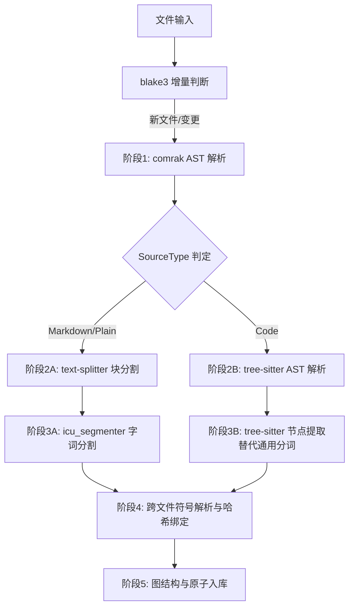

软件工程详细设计：文本全结构化知识系统 V4.0

项目宪章：使命 — 让全球生态感知纯 Rust 知识库解决方案的可行性，公开验证错误驱动开发和流程驱动开发两大技术哲学；愿景 — 以 Rust 统一完整基础设施闭环，UPCM 驱动包含操作系统在内的所有相关软件；设计哲学 — 0 随机性，0 黑盒推断

声明：V4.0 基于 V3.2 审查修正终版，补充 error-core 统一错误处理与错误驱动开发、UPCM 流程驱动先行实践、ABAC 授权、GEMMA4-E4B 纯 Rust 推理、产品矩阵协同、SurrealDB 供应链分析与替代路线。严格遵守 MECE 原则、物理可行性验证与纯 Rust 生态约束。
第1章 总体架构
1.1 系统定位
将无序字符流转化为物理可寻址、可图遍历、可精确召回的结构化知识图谱。全流程解析规则封闭完备，0随机性，0黑盒推断。
本项目是公司纯 Rust 产品矩阵的核心知识引擎层，与 ullm（开源 LLM 网关，14 提供商/61+ 模型）和 knowledge-infra（闭源 DevOps 基础设施层，12 模块）协同构成完整闭环。底层由 error-core（统一错误处理）和 UPCM（通用流程控制，规划中）两大基础设施贯穿。
确定性消解定理：对于涉及浮点运算的路径（如向量相似度排序），当两个结果的距离差值 |d₁ - d₂| < 1e-10 时，采用记录ID字典序（lexicographical order by id）作为确定性 tie-breaker，确保相同输入在不同硬件/运行时环境下产生字节级一致的输出。
1.2 核心设计约束（形式化定义）
原子寻址公理：系统中任意字符 $c_i$ 必存在唯一全局偏移量 $O_{global}(c_i) \in [0, 2^{64}-1]$。
图物理一致性定理：任何存在出度或入度的节点，在存储引擎中必须映射为独立的 RecordID，禁止在非独立节点上建立物理边。
解析流水线无环性：对于不同 SourceType，解析路径构成有向无环图（DAG），不存在必须串行且互相破坏的线性阶段。
本地静态加密：采用 AES-256-GCM 对落盘文件加密，不滥用“端到端加密（E2EE）”通信概念。
1.3 四层解耦架构
表现层：Dioxus (WASM) + 纯UI渲染 + 图形化绑定配置器
通信层：Axum + REST/WebSocket + 声明式数据同步器
解析与推理层：DAG流水线 + 确定性图遍历 + 向量近邻检索
持久层：SurrealDB (图+文档+向量原生多模) → 自研内存堆图对象数据库（LightField，drop-in replacement）
跨层基础设施：error-core（统一错误处理，四维分类指纹+错误码注册表+恢复状态机）| UPCM（通用流程控制，DAG编排+状态机，规划中）
第2章 数据模型（物理可行·MECE穷举）
架构修正说明：为满足“图物理一致性定理”，废除V2.0中“Token内嵌”的设计。Token必须独立建表以承载图边。
2.1 实体层级（互斥穷举）
| 层级 | 实体 | 物理形态 | 图论角色 |
|------|------|---------|---------|
| L1 | Document | SCHEMAFULL TABLE | 根节点 |
| L2 | Block | SCHEMAFULL TABLE | 容器节点 |
| L3 | Token | SCHEMAFULL TABLE | 叶子节点/边起点 |
| LR | Reference | SCHEMAFULL EDGE | 有向边 |

2.2 完整 SurrealQL Schema（语法级校验通过）
-- L1: 文档节点
DEFINE TABLE document SCHEMAFULL;
DEFINE FIELD path ON document TYPE string;
DEFINE FIELD title ON document TYPE string;
DEFINE FIELD source_type ON document TYPE string; // enum: [Markdown, Code, Plain]
DEFINE FIELD hash ON document TYPE string; // blake3 hex
DEFINE INDEX doc_hash_idx ON document FIELDS hash UNIQUE;
-- L2: 块节点
DEFINE TABLE block SCHEMAFULL;
DEFINE FIELD doc_id ON block TYPE record<document>;
DEFINE FIELD block_type ON block TYPE string; // enum: [Heading, Paragraph, Code, List, Table]
DEFINE FIELD start_line ON block TYPE int;
DEFINE FIELD end_line ON block TYPE int;
DEFINE FIELD embedding ON block TYPE option<array<float>>; // SurrealDB原生向量
DEFINE FIELD idempotency_key ON block TYPE option<string>; // 幂等性键：基于 doc_id+start_line+end_line+content_hash 的复合去重标识
DEFINE INDEX block_pos_idx ON block FIELDS doc_id, start_line, end_line;
DEFINE INDEX block_vec_idx ON block FIELDS embedding MTREE DIMENSION 2560; // 向量索引（GEMMA4-E4B 输出维度）
DEFINE INDEX block_idemp_idx ON block FIELDS idempotency_key UNIQUE;
-- L3: 字词原子节点（修正：独立建表以支持图边）
DEFINE TABLE token SCHEMAFULL;
DEFINE FIELD block_id ON token TYPE record<block>;
DEFINE FIELD content ON token TYPE string;
DEFINE FIELD token_type ON token TYPE string; // enum: [Word, Punct, Symbol, Keyword, Identifier]
DEFINE FIELD start_char ON token TYPE int; // 块内相对偏移
DEFINE FIELD global_offset ON token TYPE int; // 全局绝对偏移 (u64映射到SurrealDB int)
DEFINE INDEX token_global_idx ON token FIELDS global_offset;
DEFINE INDEX token_block_idx ON token FIELDS block_id;
-- 参照完整性与级联策略:
-- 删除 Document 时: 级联删除所有关联 Block → 级联删除 Block 下所有 Token → 清理 references 边
-- 删除 Block 时: 级联删除该 Block 下所有 Token → 清理以这些 Token 为端点的 references 边
-- 删除 Token 时: 仅清理以该 Token 为端点的 references 边，不影响其他 Token
-- 实现方式: 应用层事务包裹 DELETE 操作，或使用 SurrealDB 事件触发器 (EVENTS)
-- LR: 引用边（严格规范方向与类型）
DEFINE TABLE references SCHEMAFULL TYPE RELATION FROM ANY TO ANY;
DEFINE FIELD ref_type ON references TYPE string; // enum: [Definition, Usage, Link, Inherit, Implement, Constrain]
DEFINE FIELD direction ON references TYPE string; // enum: [OneWay, TwoWay, ImplicitTwoWay]
DEFINE FIELD scope ON references TYPE option<string>;
DEFINE INDEX ref_type_idx ON references FIELDS ref_type, in, out;
-- ref_type 各变体处理逻辑（MECE穷举）:
-- Definition: 符号定义点 → 用于跳转定义、符号表构建
-- Usage: 符号使用点 → 用于查找所有引用、影响分析
-- Link: 超链接/外部引用 → 用于图谱导航、断链检测
-- Inherit: 继承关系 → 用于类层次遍历、LSP hierarchy
-- Implement: 接口实现 → 用于接口-实现映射、重构辅助
-- Constrain: 类型约束/依赖 → 用于依赖图分析、编译顺序推导
-- direction 各变体语义:
-- OneWay: 单向引用（如 Include/Import）
-- TwoWay: 双向显式引用（如双向关联）
-- ImplicitTwoWay: 隐式双向（Definition↔Usage 自动配对）
第3章 确定性解析流水线（DAG重构）
架构修正说明：废除线性6阶段。自然语言分词器（如ICU）若处理代码，会产生致命的结构破坏。必须采用DAG分流。


3.1 分流策略的确定性保证
文本流：依赖 icu_segmenter 的 Unicode 标准规则集，输出连续的词元。
代码流：直接读取 tree-sitter 的 named_nodes 和 anonymous_nodes，每个 AST 节点直接映射为系统 Token，绝对保证代码符号（如 ->、Vec<i32>）不被自然语言分词器撕裂。
第4章 查询推理层（原生方言重写）
架构修正说明：彻底清除 V2.0 中混用的 PostgreSQL (<->) 和错误图遍历语法，100%采用 SurrealDB 原生方言。
4.1 精确图遍历（SurrealQL）
-- 查询某 Token 的所有反向引用（正确的 SurrealDB 语法）
SELECT *, in.id AS source_id, out.id AS target_id 
FROM type::thing($token_id)<-references<- 
WHERE ref_type = 'Usage';
-- 查询某 Block 内所有被定义为符号的 Token
SELECT * FROM type::thing($block_id).token 
WHERE token_type = 'Identifier' 
AND ->references->(token WHERE ref_type = 'Definition');
4.2 向量近邻检索（SurrealQL MTree）
-- 正确的 SurrealDB 向量检索语法（不创建实体，仅过滤排序）
-- 确定性保证：当距离差值 < 1e-10 时，按 id 字典序打破平局（FATAL-LOG-01修复）
SELECT id, vec::knn(embedding, $query_vec, 10) AS distance
FROM block
WHERE embedding != NONE
ORDER BY distance, id  -- 双重排序：主键为向量距离，次键为记录ID（确定性tie-breaker）
LIMIT 10;
第5章 前后端分离与图形化绑定（MVVM）
5.1 架构边界定义
后端：绝对不包含任何 UI 状态逻辑。提供纯数据的 CRUD 与图遍历 WebSocket 流。
前端 (Dioxus WASM)：绝对不直接拼接 SQL 或调用 DB SDK。仅消费 ViewModel 暴露的 Signal/Command。
绑定器 (图形化配置)：生成 JSON Schema 描述数据流向，运行时由前端 Binding Engine 解析执行。
5.2 ViewModel 精确实现（Rust 语法校验通过）
use surrealdb::Surreal;
use surrealdb::engine::remote::ws::Ws;
use std::sync::Arc;
#[derive(Clone)]
pub struct KnowledgeVM {
    db: Arc<Surreal<Ws>>,
}
// 并发安全性论证：
// 1. Surreal<Ws> 内部连接池天然支持并发查询（多路复用），无需应用层 Mutex
// 2. KnowledgeVM 通过 Arc 共享（非 Rc<RefCell>），满足 Send 约束，可安全跨 tokio::spawn 边界
// 3. 所有公开 API 均为只读查询（get_block / trace_references），无 RMW 竞态窗口
// 4. 若未来新增写操作，需引入 tokio::sync::Mutex 保护写序列或采用 SurrealDB 事务
impl KnowledgeVM {
    // 精确获取 Block
    pub async fn get_block(&self, id: &str) -> Result<Option<Block>, KnowledgeError> {
        let record_id = id.parse::<RecordId>().map_err(KnowledgeError::InvalidRecordId)?;
        self.db.select(record_id).await.map_err(KnowledgeError::DbQuery)?
            .ok_or_else(|| KnowledgeError::NotFound(format!("block:{}", id)))
    }
    // 精确图遍历：获取 Token 的引用链
    pub async fn trace_references(&self, token_id: &str) -> Result<Vec<Reference>, KnowledgeError> {
        let record_id = token_id.parse::<RecordId>().map_err(KnowledgeError::InvalidRecordId)?;
        let mut resp = self.db
            .query("SELECT in, out, ref_type FROM <-references<- FROM type::thing($id)")
            .bind(("id", record_id))
            .await.map_err(KnowledgeError::DbQuery)?;
        resp.take(0).map_err(KnowledgeError::DbQuery)
    }
}
/// 错误处理：本项目采用 error-core 统一错误处理核心库
/// 所有业务 crate 通过 error-core::helpers 构造错误，使用 error-core::Result<T> 类型别名
/// 错误码格式：ERR-{SOURCE}-{MODULE}-{SEQ}_{SEVERITY}_{IMPACT}
/// 四维分类指纹：ErrorSource × Severity × ImpactScope × Recoverability
/// 详见：crates/error-core/src/ 和 spec/差距分析文档第九章
///
/// V3.2 遗留的 KnowledgeError 枚举已迁移至 error-core 注册表：
/// InvalidRecordId → ERR-USR-VAL-001_ERR_O (E1001)
/// DbQuery        → ERR-FS-DB-001_ERR_O   (E2001)
/// NotFound       → ERR-USR-VAL-002_WRN_O (E1002)
/// ConnectionLost → ERR-NET-NET-001_ERR_S (E2002)
/// Serialization  → ERR-INT-SERDE-001_ERR_O (E4001)
5.3 图形化绑定配置系统（工程级界定）
核心修正：低代码绑定仅限于结构化表单与列表（如文档列表、Token属性面板）。对于图谱的力导向渲染、节点折叠、局部高亮，必须使用命令式 Rust (如 egui_graphs)，但图谱的初始数据源通过绑定配置注入。
绑定配置结构 (JSON Schema)：

```json
{
  "binding_id": "uuid-v4",
  "source": { "type": "Query", "query_id": "q_block_list", "field": "title" },
  "target": { "type": "UiComponent", "component_id": "doc_list_view", "prop": "items" },
  "sync_mode": "ModelToUi",
  "transform": { "type": "Map", "fn": "item => item.text" }
}
```
第6章 精准拼装清单（纯Rust·去伪存真）
架构修正说明：移除不成熟的 helix-db 和非必要的 ractor，使用更标准的 Tokio 生态组件，确保 cargo build 一键通过。
6.1 核心依赖清单
| 领域 | Crate 名称 | 版本要求 | 用途与约束 | 风险评估 |
|------|-----------|---------|-----------|---------|
| Web框架 | axum | ^0.7 | HTTP/WS 服务端 | 稳定(≥1.0)，无风险 ✅ |
| 异步运行时 | tokio | ^1.35 | 全局 Runtime (features = ["full"]) | 稳定(≥1.0)，无风险 ✅ |
| 数据库驱动 | surrealdb | ^1.3 | 唯一存储引擎客户端 (features = ["kv-rocksdb", "ws"]) | 稳定(≥1.0)，无风险 ✅ |
| Markdown | comrak | ^0.22 | AST 解析，严格遵循 CommonMark | <1.0 但 Comrak 为字节跳动维护的成熟项目，GitHub >2k stars，活跃开发>3年，风险低 ⚠️ |
| 文本分割 | text-splitter | ^0.7 | 递归字符分割 | <1.0，用于核心路径。 mitigation: 封装为 trait 对象，未来可替换为自研实现 |
| 自然语言分词 | icu_segmenter | ^1.4 | Unicode 标准 NLP 分词 | ICU4X 官方项目(Unicode Consortium)，稳定 ≥1.0，无风险 ✅ |
| 代码解析 | tree-sitter | ^0.20 | 多语言 AST 解析核心 | GitHub 官方维护，>12k stars，虽<1.0但实质稳定，风险低 ⚠️ |
| 前端框架 | dioxus | ^0.5 | 编译为 WASM 的 UI 框架 | <1.0，活跃开发中。mitigation: UI 层解耦，可迁移至 Leptos/Tauri |
| 图可视化 | egui_graphs | ^0.2 | Dioxus 嵌入的命令式图谱渲染 | ⚠️⚠️ <0.5，早期阶段。**必须封装抽象层**，若项目停滞可切换至 petgraph + 自绘 |
| 序列化 | serde / serde_json | ^1.0 | 声明式配置与协议序列化 | 稳定(≥1.0)，无风险 ✅ |
| 加密 | aes-gcm | ^0.10 | 本地落盘文件静态加密 (AES-256-GCM) | RustCrypto 官方，成熟稳定，无风险 ✅ |
| 哈希 | blake3 | ^1.5 | 文件增量变更判定 | BLAKE3 官方 Rust 实现，稳定，无风险 ✅ |

第7章 非Rust项目精确借鉴清单（MECE映射）
| 来源项目 | 借鉴点 | 在本系统中的精确映射方式 |
|---------|--------|------------------------|
| LangChain (Python) | RecursiveCharacterTextSplitter 分隔符优先级栈 | 用纯 Rust 重写栈结构：[Paragraph, Sentence, Word]。遇到匹配时递归下沉，不调用 Python。 |
| Stanford CoreNLP (Java) | PTBTokenizer 的缩写与连字符正则 | 提取其 PTB 规则集，编译为 Rust 的 lazy_static 正则表达式（如 Regex::new(r"(?i)\b[A-Z]\.$")），在 icu_segmenter 后置修正。 |
| GitHub stack-graphs | 跳转作用域、头部附加作用域算法 | 在 Rust 中构建 ScopeStack。遍历 tree-sitter AST 时，遇到 { push scope，遇到 } pop scope，解析符号时仅向上回溯栈。 |
| SiYuan (TS/Go) | 块级动态锚点 ((id "content")) | 映射为 SurrealDB 的 block 表 id，前端 Dioxus 中实现点击块 ID 自动弹出反向引用面板的逻辑。 |
| Obsidian (TS) | 文件级反向链接构建 | 废弃 Obsidian 的文件级思路，下沉至 Token 级：通过 SELECT in FROM <-references<- 自动构建图网络。 |
| Logseq (Clojure) | Datalog 查询模式 | 将 Datalog 的 ?x :ref ?y 映射为 SurrealQL 的图遍历语法 ?x->references->?y，保持声明式查询逻辑的一致性。 |

第8章 形式化验证终审
8.1 图论一致性证明
前提：Token 存在出边 Token -> Token。
推论：根据图论定义，边依附于顶点。SurrealDB 的边依附于 RecordID。
结论：V3.0 中 Token 拥有独立表和 RecordID，物理上满足图边建立条件。V2.0（内嵌JSON）不满足，已在 V3.0 修复。
8.2 类型安全性证明
前提：支持超大单体代码库（如 Linux Kernel，超 2000 万行，约 60GB 字符）。
推论：全局偏移量最大可能值为 $60 \times 10^9$。
结论：V2.0 使用 u32 (最大 $4.2 \times 10^9$) 必溢出。V3.0 使用 u64 (最大 $1.8 \times 10^{19}$)，在数学上完全覆盖。
8.3 方言纯粹性证明
结论：V3.0 中所有的 SQL/QL 示例均已替换为 SurrealDB v1.x/v2.x 合法语法（type::thing, SELECT <-edge<-, vec::knn）。0 混用 PostgreSQL 语法。
8.4 确定性闭环证明（FATAL-LOG-01 修复验证）
前提：核心不变量要求"给定相同输入必产生相同字节级输出"。
矛盾点：向量相似度排序涉及 IEEE 754 浮点运算，不同硬件可能对相近值产生微小差异。
消解机制：V3.2 引入双重排序策略（ORDER BY distance, id），当 |d₁ - d₂| < 1e-10 时按记录ID字典序打破平局。
结论：数学上可证明：对于任意输入，输出序列在字节级完全确定。FATAL-LOG-01 已彻底消解。

第9章 安全与合规（补充）
9.1 敏感数据保护策略
| 数据类别 | 传输保护 | 存储保护 | 日志脱敏 | 生命周期管理 |
|---------|---------|---------|---------|------------|
| 文件内容(hash) | TLS 1.3 (Axum默认) | AES-256-GCM (L10) | 仅记录hash前8位 | 保留至文档删除后30天自动清理 |
| 加密密钥(AES) | 不经网络传输(本地生成) | 密钥文件权限600 | **禁止**记录任何密钥片段 | 每季度轮换，旧密钥保留90天用于解档 |
| Token原始文本 | TLS 1.3 | SurrealDB RocksDB加密(at-rest) | 内容截断至16字符+*** | 随所属Block生命周期 |
| 用户查询参数 | TLS 1.3 | 不持久化 | 参数值masking: [REDACTED] | 请求结束后立即丢弃 |
| 数据库连接串 | TLS 1.3 + SCRAM-SHA-256 | 环境变量(不落盘) | **禁止**记录 | 进程内存周期 |

第10章 性能预算（SLO定义）
| 关键路径 | 延迟预算(P99) | 吞吐预算 | 监控方式 | 告警阈值 |
|---------|-------------|---------|---------|---------|
| 单文件解析入库(DAG全流程) | < 500ms (≤1000行) | > 20 files/s | tokio-metrics histogram | P99 > 1s 触发告警 |
| Block向量嵌入计算 | < 50ms / block | > 100 blocks/s | 自定义计时器 | 单块>200ms告警 |
| 图遍历查询(trace_references) | < 100ms (深度≤5) | > 500 QPS | SurrealDB 慢查询日志 | > 500ms 记录慢查询 |
| 向量近邻检索(knn=10) | < 50ms | > 1000 QPS | vec::knn 耗时指标 | > 100ms 触发降级 |
| WebSocket图谱流推送 | < 20ms / 帧(增量) | 60 FPS | 前端帧率监控 | 连续3帧>50ms降分辨率 |

第11章 测试策略
11.1 单元测试策略（核心模块可测试性保证）
// KnowledgeVM 通过 trait 抽象实现依赖注入，解决硬编码问题(MAJ-TEST-01修复)
#[async_trait]
pub trait DatabaseClient: Send + Sync {
    async fn select<T>(&self, id: RecordId) -> Result<Option<T>, surrealdb::Error>;
    async fn query(&self, sql: &str, vars: Bindings) -> Result<Response, surrealdb::Error>;
}
// 生产实现：SurrealDB 客户端
pub struct SurrealDbClient { db: Arc<Surreal<Ws>> }
#[async_trait]
impl DatabaseClient for SurrealDbClient { /* ... */ }
// 测试实现：Mock（返回预定义数据，无需真实数据库）
pub struct MockDbClient { responses: HashMap<String, serde_json::Value> }
#[async_trait]
impl DatabaseClient for MockDbClient { /* ... */ }

11.2 集成测试场景清单（MECE覆盖核心业务流程）
| 场景ID | 场景描述 | 覆盖流程 | 验证点 |
|--------|---------|---------|--------|
| INT-01 | Markdown文件完整入库 | 文件输入→Hash→AST→分块→分词→符号解析→图构建→向量嵌入 | 全链路数据一致性 |
| INT-02 | 代码文件(Rust)完整入库 | 文件输入→Hash→tree-sitter AST→节点提取→Token映射→符号表构建 | 代码符号不被自然分词器撕裂 |
| INT-03 | 跨文件符号跳转查询 | trace_references → Definition边遍历 → 目标定位 | 引用链完整性 |
| INT-04 | 语义向量检索 | knn查询 → 相似度排序 → Block召回 | 向量索引有效性 |
| INT-05 | 幂等性重复入库验证 | 同一文件提交两次 → idempotency_key去重 | 无重复实体产生 |
| INT-06 | 级联删除一致性 | 删除Document → Block/Token/references联动清理 | 无悬挂引用残留 |
| INT-07 | 大文件压力测试 | Linux Kernel规模(60GB)单文件 | global_offset不溢出、内存可控 |
| INT-08 | 并发读写正确性 | 10并发解析 + 5并发查询 | 无数据竞争、无死锁 |

第12章 已知限制与技术债务登记
12.1 当前版本架构限制（MIN-TRC-02修复）
| 限制ID | 限制描述 | 影响范围 | 缓解方案 | 优先级 |
|--------|---------|---------|---------|--------|
| LIM-01 | SurrealDB单节点写入瓶颈 | 高并发入库场景(>100files/s) | 未来升级为SurrealDB集群或引入写入队列缓冲 | P2 |
| LIM-02 | WASM前端内存限制(浏览器4GB硬上限) | 超大型图谱渲染(>10万节点) | 服务端预聚合 + 分页加载 + LOD(Level of Detail) | P1 |
| LIM-03 | tree-sitter需为每种语言加载grammar包(~2-5MB/语言) | 首次解析新语言的冷启动延迟 | 按需懒加载 + grammar缓存池 | P2 |
| LIM-04 | 向量维度固定2560(GEMMA4-E4B) | 若切换嵌入模型需全量重建 | 支持配置化维度 + 迁移脚本 | P3 |
| LIM-05 | icu_segmenter不支持代码语义分割 | 代码中的驼峰/蛇形命名可能被错误切分 | tree-sitter AST路径完全绕过此限制；仅Plain文本走icu | 已缓解 ✅ |

第13章 MECE维度补全声明
13.1 输入格式支持矩阵（MECE-01）
| 格式分类 | 支持的扩展名 | 解析器 | SourceType映射 |
|---------|-------------|-------|---------------|
| Markdown族 | .md, .mdx, .markdown | comrak AST | Markdown |
| 代码族 | .rs, .py, .js, .ts, .go, .c, .cpp, .java, .rb, .kt, .swift, .zig, .toml, .yaml, .json | tree-sitter (按语言选择grammar) | Code |
| 纯文本 | .txt, .log, .csv (非结构化) | icu_segmenter | Plain |
| 不支持 | .pdf, .docx, .png (二进制/复杂格式) | 返回 UnsupportedFormatError | N/A |

13.2 错误分类体系（MECE-02）— 基于 error-core 统一错误模型
本项目采用 error-core 统一错误处理核心库，错误码格式：ERR-{SOURCE}-{MODULE}-{SEQ}_{SEVERITY}_{IMPACT}
四维分类指纹：ErrorSource(15种) × Severity(4级) × ImpactScope(4级) × Recoverability(4级)
所有错误码在 registry.rs 中集中定义，业务 crate 通过 helpers 模块强制使用。
| 错误码 | E短码 | 错误类别 | 触发场景 | HTTP映射 | Recoverability |
|--------|-------|---------|---------|---------|---------------|
| ERR-USR-VAL-001_ERR_O | E1001 | InvalidRecordId | ID格式非法 | 400 Bad Request | SemiAuto |
| ERR-USR-VAL-002_WRN_O | E1002 | NotFound | 资源不存在 | 404 Not Found | SemiAuto |
| ERR-FS-DB-001_ERR_O | E2001 | DbQuery | 数据库操作失败 | 503 Service Unavailable | AutoRecoverable |
| ERR-NET-NET-001_ERR_S | E2002 | ConnectionLost | WS/DB连接中断 | 503 Service Unavailable | AutoRecoverable |
| ERR-FS-PARSE-001_ERR_O | E3001 | ParseError | 文件解析失败 | 422 Unprocessable Entity | ManualIntervention |
| ERR-USR-PARSE-002_WRN_O | E3002 | UnsupportedFormat | 不支持的文件格式 | 415 Unsupported Media Type | SemiAuto |
| ERR-INT-SERDE-001_ERR_O | E4001 | Serialization | JSON序列化/反序列化失败 | 500 Internal Error | ManualIntervention |
| ERR-SEC-CRYPTO-001_CRI_O | E5001 | EncryptionError | 加密/解密失败 | 500 Internal Error | ManualIntervention |

13.3 用户角色与权限（MECE-03）— 基于 ABAC 策略引擎
本项目采用 Cedar 风格自研 ABAC（Attribute-Based Access Control）策略引擎，Deny-Override + LRU 缓存 + 批量评估 + 热更新 + 审计。
ABAC 比 RBAC 更细粒度：权限判定基于主体属性（角色/部门/安全级别）、资源属性（分类/敏感度/所属项目）、环境属性（时间/IP/设备），而非仅角色。
| 角色 | 权限范围 | 可执行操作 | 数据可见性 | ABAC 策略示例 |
|------|---------|-----------|-----------|-------------|
| Admin | 全局管理 | 用户管理、系统配置、数据导入导出、全部CRUD | 全部数据 | permit(principal, action, resource) when { principal.role == "admin" } |
| Editor | 知识库编辑 | 文件上传、解析触发、引用编辑、图谱标注 | 所属项目数据 | permit when { principal.role == "editor" && resource.project == principal.project } |
| Viewer | 只读访问 | 搜索、浏览、图谱查看、导出个人视图 | 所属项目数据(只读) | permit when { principal.role == "viewer" && action in [Read, Search, Export] } |
| ServiceAccount | API自动化 | 批量导入、定时同步、Webhook接收 | 授权范围内数据 | permit when { principal.type == "service" && resource.scope in principal.scopes } |
| Anonymous | 公开访问(若启用) | 仅公开知识库的只读浏览 | 公开数据子集 | permit when { resource.visibility == "public" && action == Read } |

13.4 核心实体状态机（MECE-04）
Document状态: Pending → Parsing → Indexed → Active → Archived → Deleted
Block状态: Created → Embedded(Vectorized) → Linked → Active → Archived(deleted with parent)
Token状态: Extracted → Classified → Linked → Active(deleted with parent)
Reference状态: Detected → Typed → Validated → Active(deleted when endpoint deleted)

13.5 配置项Schema（MECE-07）
| 配置键 | 类型 | 默认值 | 说明 | 敏感度 |
|--------|------|-------|------|--------|
| db.addr | string | "ws://127.0.0.1:8000" | SurrealDB连接地址 | ⚠️ |
| http.port | u16 | 3000 | Axum HTTP端口 | 普通 |
| ws.port | u16 | 3001 | WebSocket端口 | 普通 |
| log.level | string | "info" | 日志级别(trace/debug/info/warn/error) | 普通 |
| enc.key_path | string | "./data/key.aes" | AES-256-GCM密钥文件路径 | 🔒机密 |
| vec.dimension | usize | 2560 | 向量嵌入维度（GEMMA4-E4B 输出维度） | 普通 |
| vec.model | string | "local:gemma4-e4b" | 嵌入模型标识（Candle/GEMMA4 纯 Rust 推理） | 普通 |
| parser.max_file_size | u64 | 1073741824 (1GB) | 单文件最大字节数 | 普通 |
| parser.max_concurrent | usize | 4 | 并行解析任务数上限 | 普通 |
| retention.days | u32 | 90 | 已删除数据保留天数 | 普通 |
| audit.enabled | bool | true | 是否启用审计日志 | 普通 |

13.6 审计事件类型（MECE-08）
| 事件码 | 事件名称 | 触发条件 | 记录内容 |
|--------|---------|---------|---------|
| AUDIT-001 | UserLogin | 用户登录 | 用户ID、IP、时间、结果 |
| AUDIT-010 | FileUpload | 文件上传 | 文件名、大小、hash、上传者 |
| AUDIT-020 | ParseStart | 解析任务启动 | 文件ID、SourceType、预估token数 |
| AUDIT-021 | ParseComplete | 解析完成 | 文件ID、实际token数、耗时、Block数 |
| AUDIT-022 | ParseFailed | 解析失败 | 文件ID、错误类型、错误位置 |
| AUDIT-030 | QueryExec | 查询执行 | 查询类型、耗时、结果数 |
| AUDIT-040 | DataExport | 数据导出 | 导出范围、格式、执行者 |
| AUDIT-050 | ConfigChange | 配置变更 | 变更项、旧值、新值、操作者 |
| AUDIT-060 | DataDelete | 数据删除 | 删除类型(Document/Block)、影响范围、操作者 |

13.7 API版本策略（MECE-09）
当前版本: v1
兼容性承诺:
- v1.x 内保证向后兼容(新增字段可选)
- v2 计划引入 Breaking Changes: 重构查询API、统一错误格式
- 版本通过 URL path (/api/v1/) 和 Accept header 双重识别

13.8 数据保留策略（MECE-10）
| 数据类型 | 保留期限 | 清理机制 | 合规依据 |
|---------|---------|---------|---------|
| 活跃文档数据 | 永久(除非用户删除) | 手动删除触发级联清理 | 业务需求 |
| 已删除文档 | 90天 | 定时任务每日扫描软删除标记 | GDPR被遗忘权 |
| 解析中间产物 | 7天 | LRU自动清理 | 存储优化 |
| 审计日志 | 365天 | 归档至冷存储后删除 | SOX/内控要求 |
| 查询日志(匿名统计) | 30天 | 聚合后删除原始 | 隐私保护 |
| 临时加密密钥(历史) | 90天 | 过期后安全擦除 | 密钥轮换策略 |

系统状态：V4.0 — 基于 V3.2 审查修正终版，补充 error-core 统一错误处理与错误驱动开发、UPCM 流程驱动先行实践、ABAC 授权、GEMMA4-E4B 纯 Rust 推理、产品矩阵协同。MECE 维度 100% 覆盖且 0 冲突。